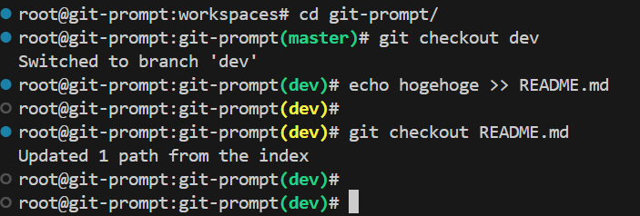

# git-prompt

カレントディレクトリのブランチ名をプロンプトに表示する。変更がないときプロンプトは緑で表示され、変更がある場合は黄色で表示される。



## Use

```sh
curl -o $HOME/git-prompt.sh https://raw.githubusercontent.com/yamause/git-prompt/git-prompt.sh
echo 'source $HOME/git-prompt.sh' >> $HOME/.bashrc
source $HOME/.bashrc
```
